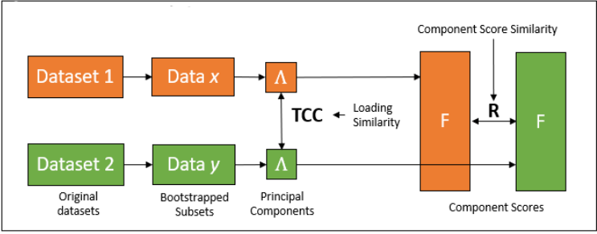

## **Direct-Projection Reproducibility**
### *How similar are the components produced by different situations?*

Another important question to ask after representing with a set of components is how well do those emergent summary variables generalize across different situations? 

The rhom module goes about answering this question using the **dir_proj()** function, comprising a technique we termed 'direct-projection reproducibility'. This method essentially involves taking datasets from different samples, or the same sample at different timepoints, and simply analyzing the similarity of the components between each dataset (See our pages on *[Tucker's Congruence Coefficient]()* and *[R-Homologue]()* to learn about how we measure component similarity). To generate more robust similarity estimates, this method includes a bootstrapping/cross-validation approach where each dataset is divided into *k* folds and every combination of folds from one dataset is compared to every combination of folds in another. See the figure below for a graphical representation of this technique (adapted from Chitiz et al., 2024).

**Analyzing similarity between datasets**

*A visualisation of the ‘direct-projection’ method whether datasets derived from different samples produce similar components. 𝛬 = Principal components, F = Component scores, TCC = Tucker's Congruence Coefficient.*

Measures of component similarity across samples can be useful for establishing the robustness of a set of these emergent variables in terms of their generalizability, but can also provide interesting insight in their own right. Recall that components represent multivariate patterns in large groups of variables. As such, component similarity across different samples to a certain degree captures how sets of variables relate differently to each other depending on the sample from which one is measuring them (Chitiz et al., 2024). 

## References

Chitiz, L., McKeown, B., Mulholland, B., Wallace, R., Goodall-Halliwell, I., Ho, N. S.-P., Konu, D., Poerio, G. L., Wammes, J., Milham, M. P., Klein, A., Jefferies, E., Leech, R., & Smallwood, J. (2024). Mapping cognition across lab and daily life using experience-sampling. PsyArXiv.
